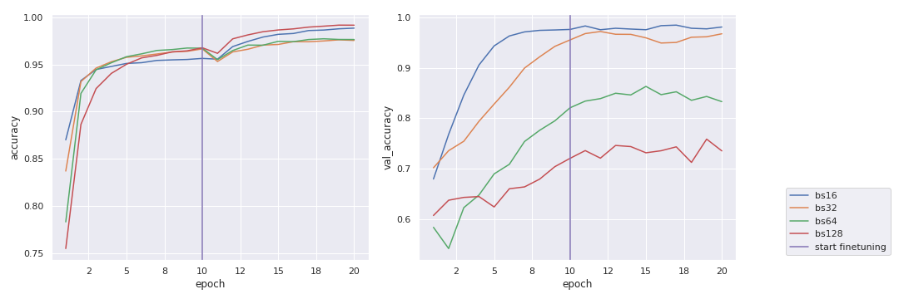
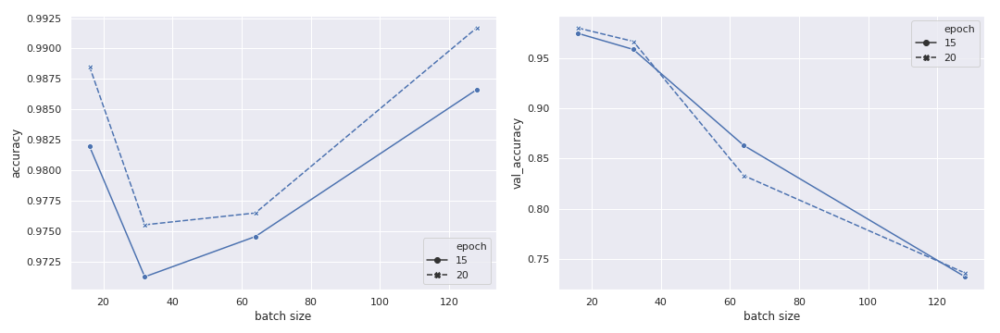

# batch_size_characterization
Effect of batch size on training and validation accuracy

The batch size in gradient descent optimization, is an important hyperparameter next only to the learning rate. Empirical results show that the mini-batch size affects the size of the generalization gap (the gap between the training and test accuracy) by as much as 5%. Smaller batches have a narrower gap and the common explanation offered is that smaller mini-batches add noise to the gradient estimation; this has a regularizing effect which allows the model to generalize better. Larger mini-batches, on the other hand, have a smaller variance and the stochastic gradient updates are less noisy. 

In this exercise, we characterize the training and validation accuracy for batch sizes in the 16 - 128 regime. [This colab notebook](https://github.com/Meena-Mani/batch_size_characterization/blob/master/batch_size_characterization.ipynb) has the data and the plots.

The image dataset comes from the [Aerial Cactus Identification Challenge](https://www.kaggle.com/c/aerial-cactus-identification)  on Kaggle. We set up our experiments within a **transfer learning** classification framework using the **MobileNetV2** architecture with pretrained ImageNet weights and **TensorFlow 2.0**. The training is done in two stages: feature extraction and fine-tuning. The model is trained for **20 epochs**, split 10/10 for each stage. [This colab notebook](https://github.com/Meena-Mani/batch_size_characterization/blob/master/aerial_cactus_identification.ipynb) shows the full training steps.

We use the following **batch sizes: 16, 32, 64, 128**. 
For each batch size, we perform three trial runs and the average of these runs is plotted.
Since there is an interplay between learning rate and batch size, we keep the learning rate constant to observe trends along a single dimension.

### Results
The training (left) and validation accuracy (right) over 20 epochs. Each plot is averaged over the three runs. The results are shown for batch size 16, 32, 64, 128. 

The training and validation accuracy (averaged over the three runs) as a function of batch size. The results shown are at two time slices: 15 epochs and 20 epochs.

The results show a consistent trend where the generalization gap increases with mini-batch size. These observations are in line with results in the published literature.
